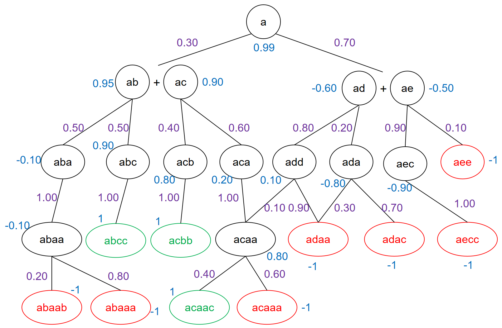
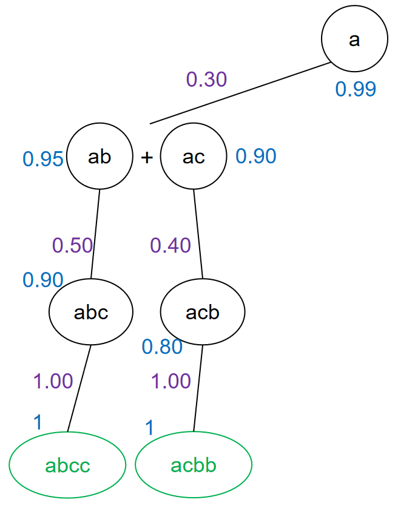
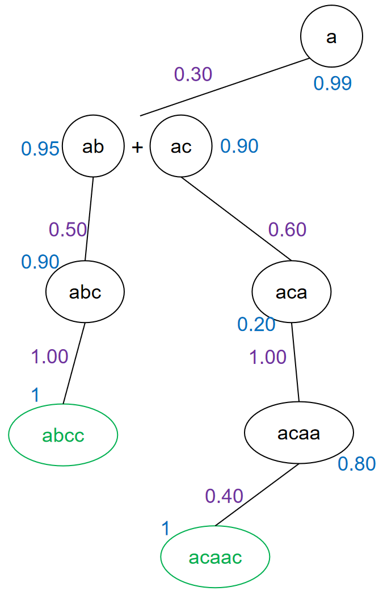
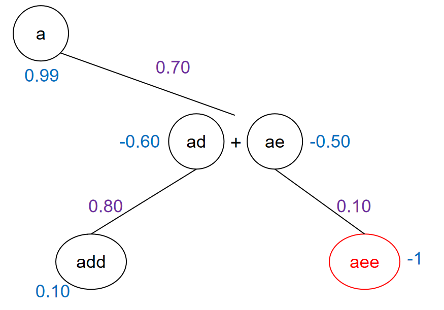

# Introduction #

----------
**mcts_base.py** is a MCTS (reference: AlphagoZero) program written in python that can be inherited by user-defined child class. Users only need to provide in the child class methods to generate choices for each step s with their probability distribution, and the value function for each step s:
> f(s) = [v, [[s1,s2],[p1,p2]]] 
> 
> or f(s) = [None, [[s1,s2],[p1,p2]]] and V(s) = v.
> 
> where s1 = [branch1 of choice1, branch2 of choice1 ...]

and provide a method to judge wether a state(step/node) is a successful ending.

**example.py** shows an example of how to use this program. Neural networks, computational programs etc. can be linked to the program to generate choices, probability distribution and value.

# Technical Points of Implementation #

----------
1. **API and Inheritance.** This program provides an API for MCTS tasks. Users can link their own problems to the MCTS backbone through inheritance of the base class MCTS_BASE, as is described in **Introduction** and **Example** part. Policy and value generated through MCTS can be saved for Reinforcement Learning in this program.

2. **DFS.** This program adopts recursion for DFS search (see **mcts_base.py/MCTS_BASE._dfs method**). In one recursion, first select choice with max(Q+U) score, then call the dfs function recursively to go to child nodes, and at last when reaching stopping conditions update node&edge data and return.

3. **Muti-Process Parallel.** Note that one choice of a step may generate several child nodes --take Retro-synthesis in Chemistry as an example, one big molecule may be decomposed into 2 simpler molucules through one choice of reaction; and may also be decomposed into 3 simpler molucules through another choice of reaction... Here child nodes of choice a from a node s is called branches(s,a). DFS across these branches can be paralleled in my design. Since the python interpreter executes threads serially, python must use process parallelism. Here I use the **multiprocessing** lib in python and conduct parallelism with **multiprocessing.Process()** method. The search space, i.e. the search tree of the nodes and edges already been visited through DFS, is shared across processes using **multiprocessing.Manager().dict()**. When updating data in a node in the shared search space, process lock **multiprocessing.Lock()** is adopted to ensure all data from different processes would be collected (see **MCTS_BASE.play & MCTS_BASE._dfs**).

4. **Beam search.** This program can generate multiple routes. If we want to genetate k routes, for each step, beam search is used to pick the routes with top-k mean probability (from policy generated by MCTS) among all routes (see **MCTS_BASE.play**). For each route Ri from top-k routes in the last step, top-k choices for the next step would be generated from Ri, so a total of k^2 routes will be generated, and then top-k routes from these k^2 routes would be picked. To generate the "second best" route from the best route in the next step for Ri, only the branch with the highest "second best" probability is substituted, and I use the **maximum heap** (**heapq** lib in python) to pick the kth max choice. DFS of each beam in a step is also parallel across processes (see **MCTS_BASE.play**). Search space of each beam is shared, in order to accumulate results from exploration of the same search space so that a more precise probability distribution can be obtained.

5. **Time-space economics.** I try to reduce the number of disc readings and avoid double counting of the same object.

# MCTS Algorithm #

----------
MCTS is a tree search method for problems of which the search space cannot be exhausted. MCTS conducts a few times of search to pick the choice with the highest visiting number, i.e. the highest probability to be picked. The backbone of this MCTS references the AlphagoZero paper *Mastering the game of Go without human knowledge*. 

For each step (see **mcts_base.py/MCTS_BASE.play** method), MCTS conducts several (e.g. 400) times of the exploration and chooses the choice with the max visiting number N and then goes to the next step (see **MCTS.dfs_main**). The MCTS computed probability distribution, i.e. policy of the choices from a step can be seen as a improvement of the prior probability distribution provided by the user (e.g. the neural network guessed probability), and is computed as follows:

> policy(choice a for step/node s) = policy(s,a) = N(s,a)^(1/t) / sum(N(s,a)^(1/t) for all choices a from s)
> 
> where t is temprature coefficient set by user, default to 1.0

After that, MCTS conducts a seach of the search space (a tree or a graph) from the nodes picked for the next step and retains those nodes searched. Those nodes not searched is considered useless and will be discarded (here I adopt **Queue** in python to conduct **BFS**, see **MCTS.dfs_main**).

The data structure of a node is (see **mcts_base.py/NODE** class):
> childlist: list of all choices
> 
> Nlist: list of visit count for each choice/edge a(i) from parent node to choice i
> 
> Plist: list of prior probability generated by user difined method for each choice/edge
> 
> Qlist: list of average value q(s,a) for each choice a of step s.
> 
> V: value function of the node

For each time of DFS exploration, MCTS does the following things(see **MCTS_BASE._dfs**):

1. **Select.** For the current node s, for each edge a(current node, choice i):
U(s,a) = cP(s,a)(sum(Nlist)**0.5)/(1+N(s,a))
Choose the edge a with the max(Q(s,a)+U(s,a)) and go to its child nodes.

2. **Expand and evaluate.** If the node s hasn't been visited, initialize childlist and Plist with the method you've defined, and N(s,a) = 0.

3. **Backup.**  For each node, for each edge a visited:

- N(s,a)++.

- V = 1 if s is a successful end node; V = -1 if s has no child to search down; V = value function(s) if search depth reaches max count and s is not an end state mentioned above. For other nodes (internal nodes):

- For avg method, V(s) = mean(V(branch[i] of the choice picked) for branch[i] in a choice) if V(branch[i]) for all i is not -1 else -1.

- For min method, V(s) = min(V(branch[i] of the choice picked) for branch[i] in a choice) if V(branch[i]) for all i is not -1 else -1.

- Q(s,a) += (V(s)-Q(s,a))/N(s,a)

# An Example for Your Reference #

----------
Here we manually defined a whole search space (see **example.json**):

Purple value on the edge a from step s means the prior probability of choosing a from s. Note that one edge(choice) may generate multiple child nodes (multiple branches must all be solved). Blue value on the node means the prior value function of the node V(s). Green node means a successful ending, while red node means a step/state which has no choice to go down --a failed ending. These generating method and judging method need to be defined by user.

The example of how to use the MCTS_BASE class with this specific problem can be seen in **example.py**

The results of running **example.py** with **mcts_times = 3, max_route_len = 6, max_search_depth = 2** are as follows:

For single-route generation (see **answers_0_route_0**):

For multi-route generation, here we make the program generate 3 alternative routes with beam search:

Top-1 answer (see **answers_1_route_0**) is the same as that in single-route generation.

Top-2 answer (see **answers_1_route_1**):

Top-3 answer (see **answers_1_route_2**): 

As only 2 routes in the whole search space can reach a successful ending, the top-3 answer reports a failed result.

As I turned the debug mode on, in **log.out** you can see data of intermediate processes of MCTS.